# Manual de Usuario — Portal para Padres de Familia USEBEQ

**Dirigido a:** Padres y tutores de alumnos de educación básica del Estado de Querétaro.
**Versión del documento:** 1.0 — Junio 2026

---

## Índice

1. [¿Qué es el Portal para Padres?](#1-qué-es-el-portal-para-padres)
2. [Acceso al portal](#2-acceso-al-portal)
3. [Crear una cuenta (registro)](#3-crear-una-cuenta-registro)
4. [Activar la cuenta](#4-activar-la-cuenta)
5. [Iniciar sesión](#5-iniciar-sesión)
6. [Recuperar contraseña](#6-recuperar-contraseña)
7. [Panel principal (inicio)](#7-panel-principal-inicio)
8. [Vincular un estudiante](#8-vincular-un-estudiante)
9. [Ver detalle del alumno y descargar boletas](#9-ver-detalle-del-alumno-y-descargar-boletas)
10. [Mi perfil](#10-mi-perfil)
11. [Servicios del portal](#11-servicios-del-portal)
12. [Trámites en línea](#12-trámites-en-línea)
13. [Cerrar sesión](#13-cerrar-sesión)
14. [Preguntas frecuentes y soporte](#14-preguntas-frecuentes-y-soporte)

---

## 1. ¿Qué es el Portal para Padres?

El **Portal para Padres de Familia de la USEBEQ** es una plataforma en línea donde los padres y tutores pueden:

- Consultar la información académica de sus hijos (nivel, grado, grupo y ciclo escolar).
- Descargar las **boletas de calificaciones** (actuales e históricas).
- Realizar **trámites escolares** de forma digital (bajas por traslado, duplicado de certificado, revocación de grado).
- Verificar la autenticidad de documentos (BOEVA).
- Consultar avisos, documentos normativos y preguntas frecuentes.
- Enviar consultas y documentos a través del buzón de padres.

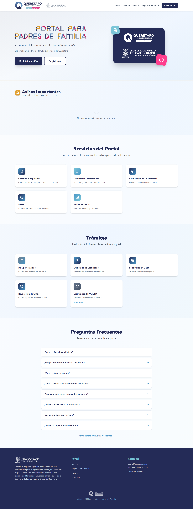

---

## 2. Acceso al portal

Abre tu navegador web (Google Chrome, Microsoft Edge o Firefox) e ingresa a la dirección del portal:

> **https://portal.usebeq.edu.mx** *(la dirección final será proporcionada por la USEBEQ)*

Desde la página de inicio puedes:

- **Iniciar sesión** si ya tienes cuenta.
- **Registrarte** si es la primera vez que usas el portal.
- Consultar los **servicios y trámites** disponibles.

---

## 3. Crear una cuenta (registro)

Si es la primera vez que utilizas el portal, deberás crear una cuenta:

1. En la página de inicio, haz clic en **"Regístrate"**.
2. Llena el formulario con tus datos: nombre, apellidos, correo electrónico y contraseña.
3. Haz clic en **"Crear cuenta"**.

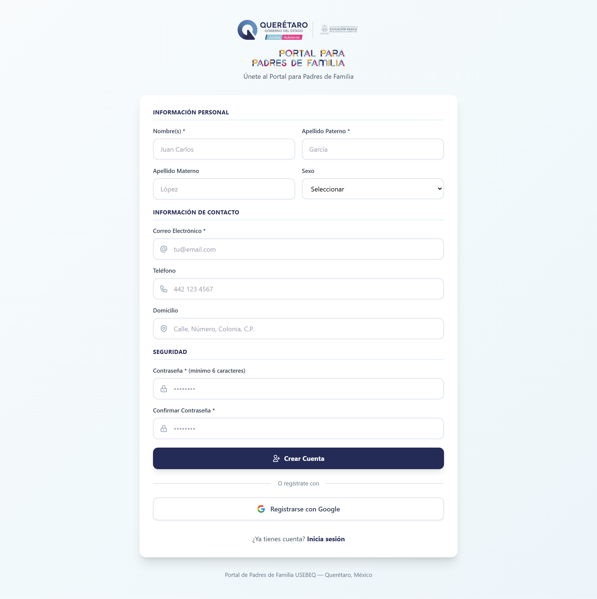

> 💡 **Importante:** La contraseña debe tener al menos **6 caracteres**. Usa un correo electrónico al que tengas acceso, ya que ahí recibirás el enlace de activación.

---

## 4. Activar la cuenta

Después de registrarte, tu cuenta queda en estado **PENDIENTE**:

1. Revisa la bandeja de entrada del correo que registraste (revisa también la carpeta de **correo no deseado / spam**).
2. Abre el correo de **Portal USEBEQ** y haz clic en el enlace de **activación**.
3. Tu cuenta quedará **activa** y podrás iniciar sesión.

---

## 5. Iniciar sesión

1. En la página de inicio, haz clic en **"Iniciar sesión"**.
2. Ingresa tu **correo electrónico** y tu **contraseña**.
3. Haz clic en **"Iniciar Sesión"**.

También puedes acceder rápidamente con tu cuenta de Google haciendo clic en **"Iniciar sesión con Google"**.

---

## 6. Recuperar contraseña

Si olvidaste tu contraseña:

1. En la pantalla de inicio de sesión, haz clic en **"¿Olvidaste tu contraseña?"**.
2. Ingresa el **correo electrónico** con el que te registraste.
3. Haz clic en enviar. Recibirás un correo con un enlace para **restablecer tu contraseña**.
4. Abre el enlace, escribe tu **nueva contraseña** y guárdala.

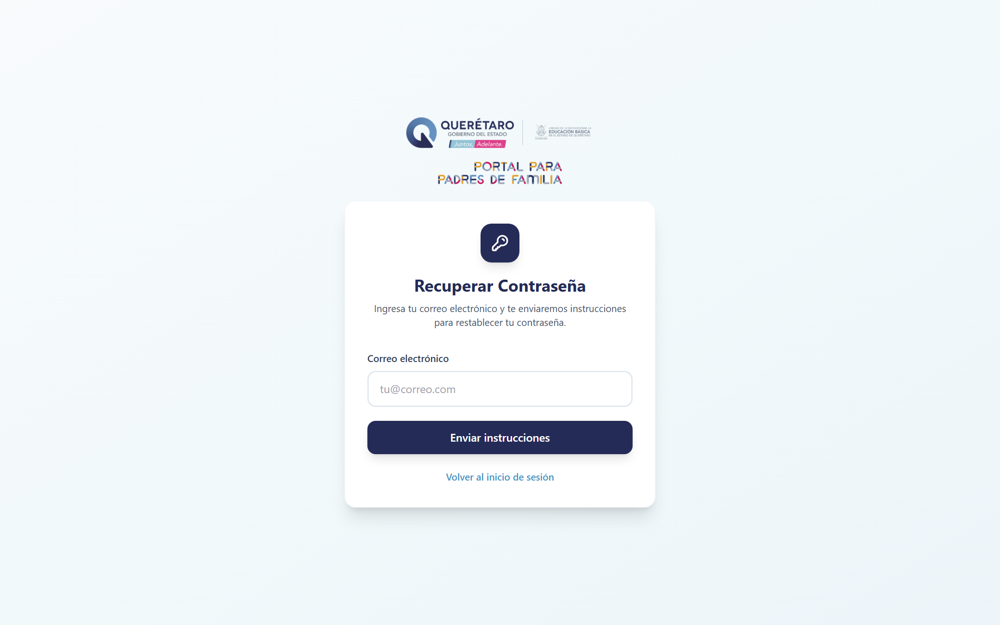

---

## 7. Panel principal (inicio)

Una vez que inicias sesión, verás tu **panel principal**. Aquí encontrarás:

- Un saludo de bienvenida y un resumen de tus estudiantes vinculados.
- Las **tarjetas de tus estudiantes**, cada una con su información académica (nivel, grado, grupo y ciclo escolar) y su estatus (Inscrito, Baja, etc.).
- Botones para **Ver Detalle** y **Descargar Boleta** de cada alumno.
- El acceso directo a todos los **Servicios del Portal**.

---

## 8. Vincular un estudiante

Para asociar a tu hijo(a) a tu cuenta:

1. En el panel principal, haz clic en **"+ Vincular Estudiante"**.
2. Ingresa la **CURP** del alumno y la **Clave del Centro de Trabajo (CCT)** de su escuela.
3. Selecciona tu **relación** con el alumno (padre, madre o tutor).
4. Haz clic en **"Vincular"**.

El alumno aparecerá como una nueva tarjeta en tu panel. Si el sistema detecta **hermanos** del alumno, te preguntará si deseas vincularlos también.

> 💡 La CURP y la CCT las puedes encontrar en documentos escolares del alumno (boleta, constancia de inscripción, etc.).

---

## 9. Ver detalle del alumno y descargar boletas

Desde la tarjeta de cada estudiante:

- **Ver Detalle:** muestra la información completa del alumno.
- **Descargar Boleta:** te permite elegir entre:
  - **Boleta Actual** — la del ciclo escolar vigente.
  - **Boleta Histórica** — selecciona el ciclo escolar (año de inicio) del que deseas la boleta.

La boleta se descarga en formato **PDF** lista para imprimir.

> 💡 Si el alumno no tiene boleta disponible para el ciclo seleccionado, el sistema te lo indicará con un mensaje.

---

## 10. Mi perfil

Para consultar o actualizar tus datos personales:

1. En la barra superior, haz clic en **"Perfil"**.
2. Edita tu información (nombre, apellidos, teléfono, domicilio).
3. Haz clic en **"Guardar Cambios"**.

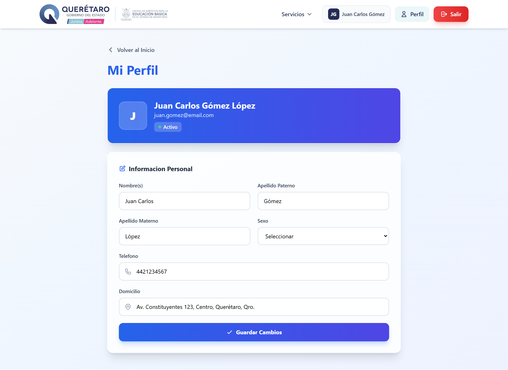

---

## 11. Servicios del portal

Desde el panel principal o el menú **"Servicios"** puedes acceder a:

### 11.1 Consulta e impresión de calificaciones (por CURP)

Permite consultar las calificaciones de un estudiante **ingresando únicamente su CURP**, sin necesidad de iniciar sesión.

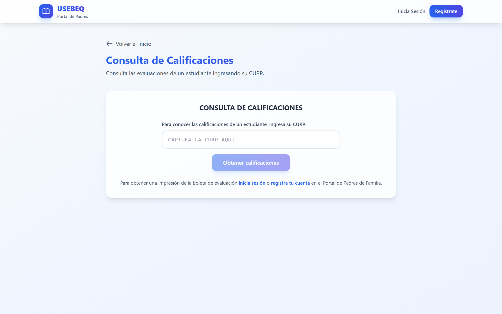

### 11.2 Avisos

Mantente informado de las novedades y comunicados de la USEBEQ.

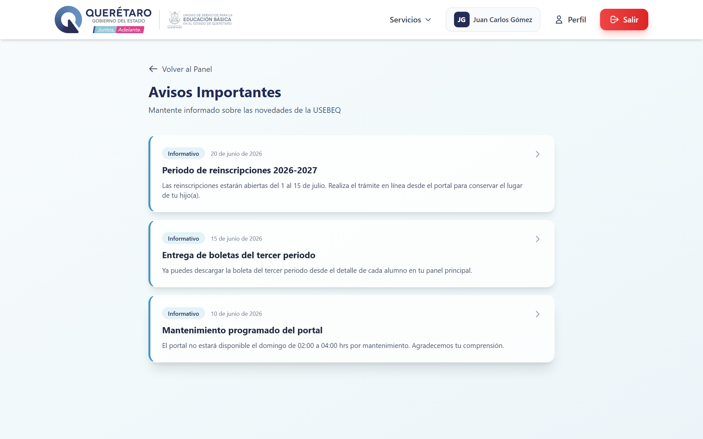

### 11.3 Documentos normativos

Consulta los acuerdos y normas de control escolar vigentes.

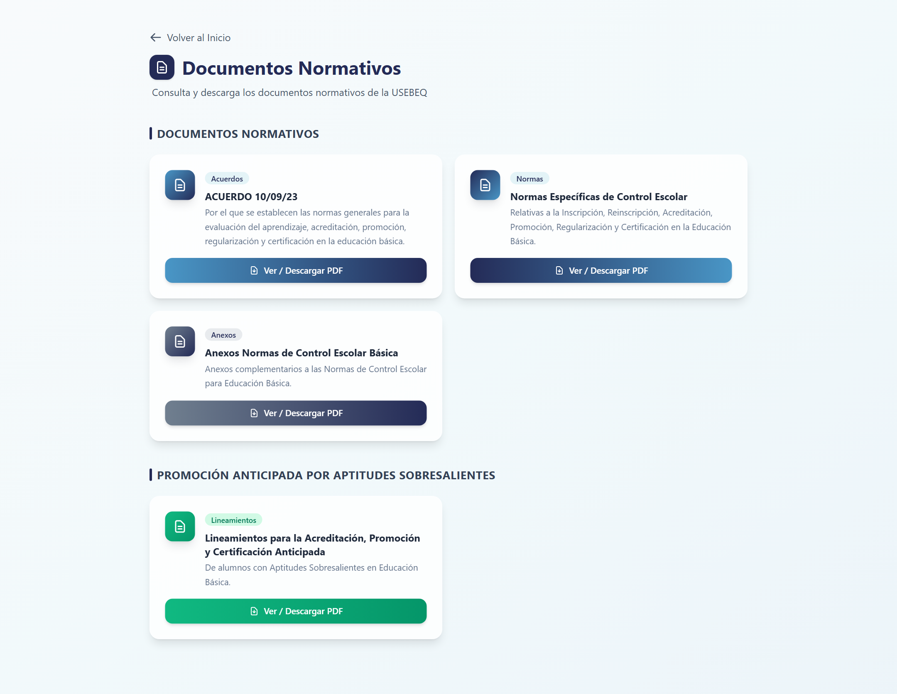

### 11.4 Verificación de documentos (BOEVA)

Verifica la **autenticidad** de boletas y documentos emitidos por la USEBEQ ingresando el folio o escaneando el código QR.

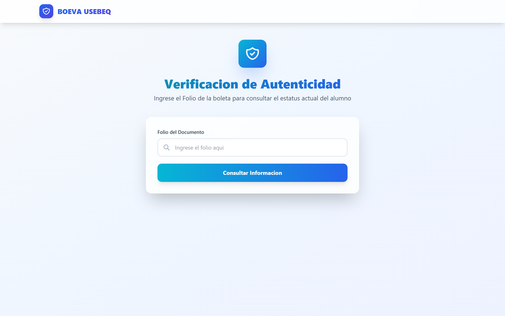

### 11.5 Becas

Consulta la información sobre las becas disponibles.

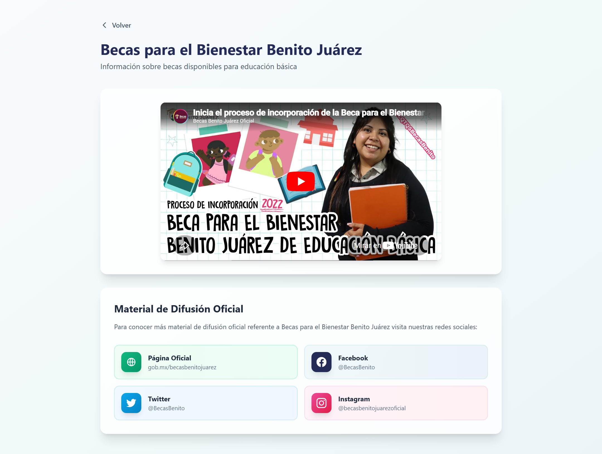

### 11.6 Buzón de padres

Envía documentos, consultas o comentarios a la USEBEQ.

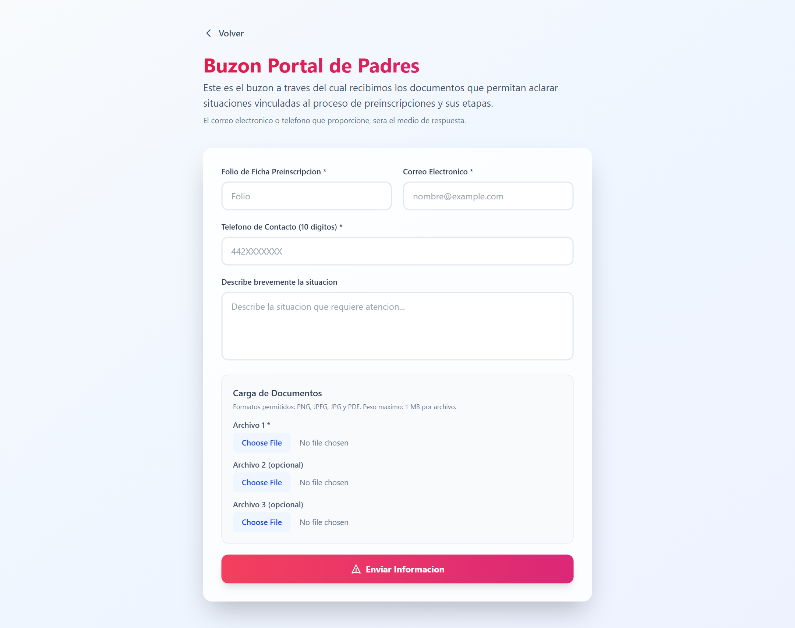

### 11.7 Preguntas frecuentes (FAQ)

Encuentra respuestas a las dudas más comunes sobre el portal.

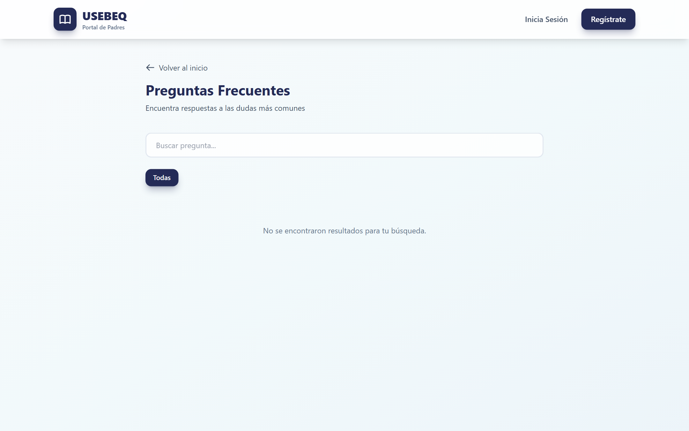

---

## 12. Trámites en línea

El portal permite realizar trámites escolares de forma digital. Al finalizar cada trámite recibirás un **folio** con el cual podrás consultar el estatus de tu solicitud.

### 12.1 Baja por traslado

Solicita la baja de un alumno por cambio de escuela u otro motivo del catálogo oficial.

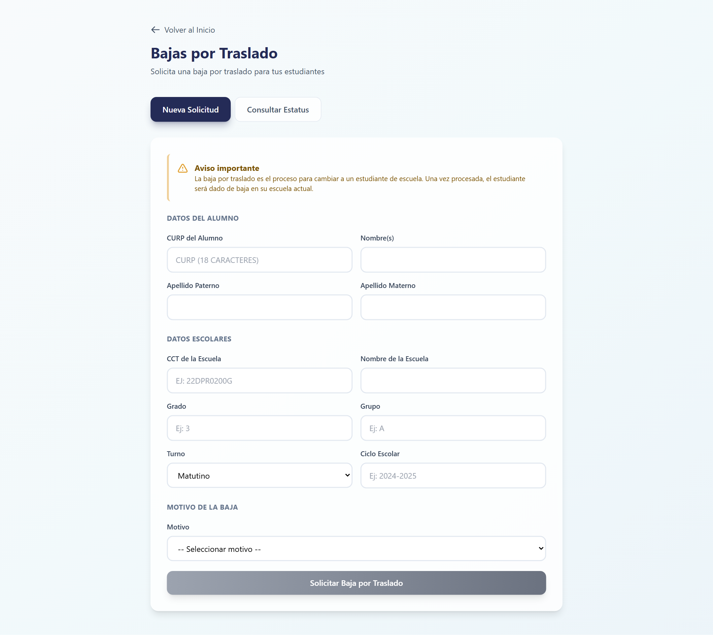

### 12.2 Duplicado de certificado

Solicita la reposición de un certificado.

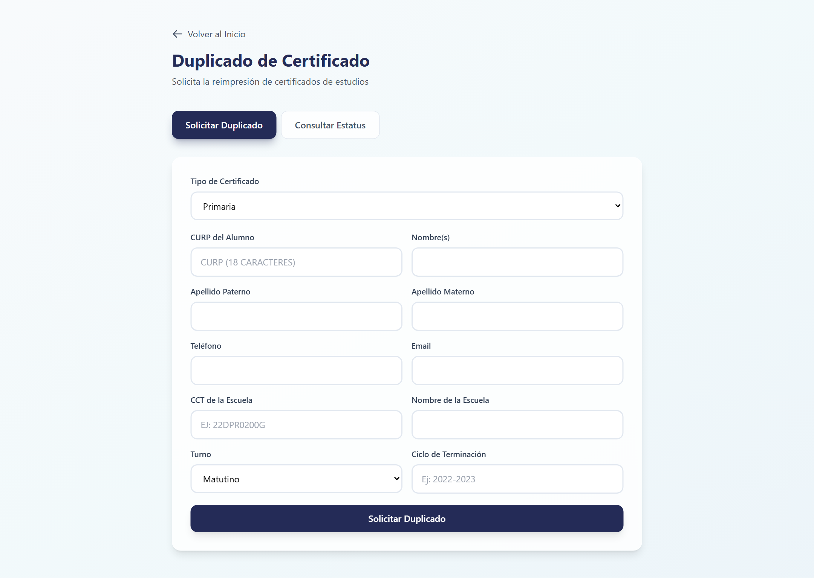

### 12.3 Revocación de grado

Captura una solicitud de revocación de grado.

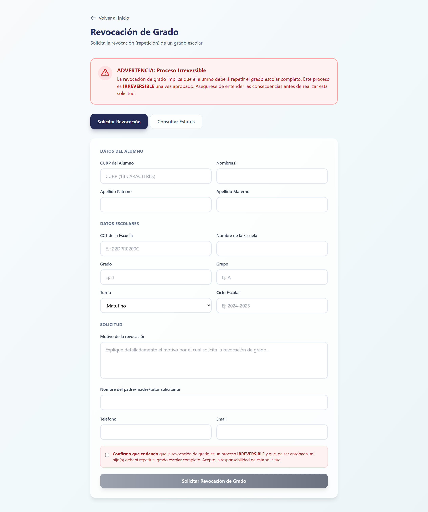

### 12.4 Soluciones en línea

Accede a los trámites y servicios digitales disponibles.

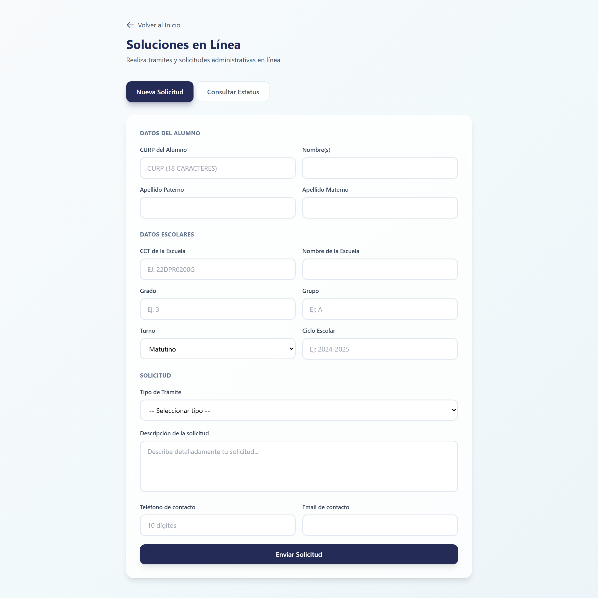

> 💡 **Consulta de estatus:** guarda el **folio** que te entrega el sistema al finalizar cada trámite. Con él podrás dar seguimiento al avance de tu solicitud.

---

## 13. Cerrar sesión

Para salir de forma segura, haz clic en el botón rojo **"Salir"** ubicado en la esquina superior derecha de la barra de navegación. Esto es especialmente importante si usas una computadora compartida o pública.

---

## 14. Preguntas frecuentes y soporte

| Pregunta | Respuesta |
|----------|-----------|
| **No me llegó el correo de activación** | Revisa la carpeta de spam/correo no deseado. Si no llega, intenta registrarte de nuevo verificando que el correo sea correcto. |
| **Olvidé mi contraseña** | Usa la opción **"¿Olvidaste tu contraseña?"** en la pantalla de inicio de sesión. |
| **No encuentro a mi hijo(a) al vincularlo** | Verifica que la **CURP** y la **CCT** sean correctas. Ambas deben coincidir con los registros de la escuela. |
| **La boleta no está disponible** | Es posible que aún no se haya cargado la del ciclo seleccionado. Intenta con otro ciclo o más adelante. |
| **¿Puedo vincular a varios hijos?** | Sí. Usa **"+ Vincular Estudiante"** por cada uno. El sistema también puede sugerir hermanos automáticamente. |

Para dudas adicionales, utiliza el **Buzón de Padres** dentro del portal o contacta a la USEBEQ por los medios oficiales:

- **Sitio oficial:** https://www.usebeq.edu.mx
- **Correo:** *(correo de soporte proporcionado por la USEBEQ)*

---

*Portal para Padres de Familia — USEBEQ, Querétaro, México.*
